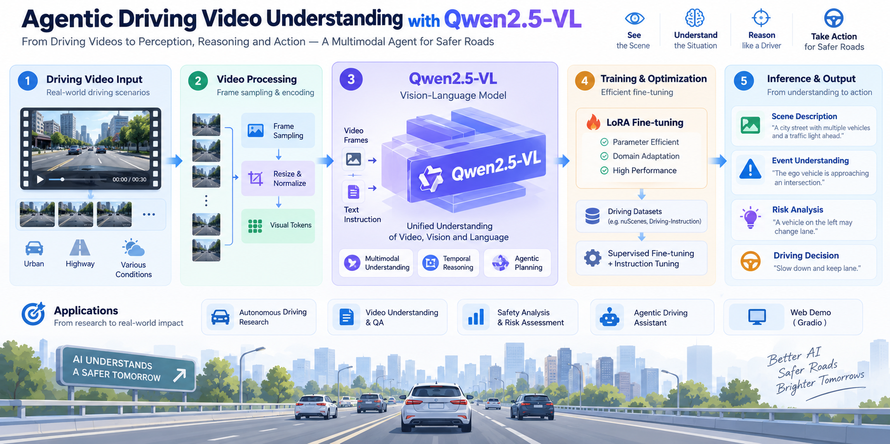

# Agentic Driving Video Understanding with Qwen2.5-VL

> Fine-tuning, temporal sampling, and agentic video analysis with Qwen2.5-VL for safety-critical driving understanding.

---

<p align="center">
  
</p>

## 🎯 Overview

This project develops **Qwen2.5-VL-7B** from a general-purpose vision-language model into an **agentic driving-video analysis system** for offline safety analysis.

The project progresses through three stages:

```text
Experiment 1: Domain Adaptation
Qwen2.5-VL
→ LoRA Fine-Tuning
→ Driving Video Understanding

Experiment 2: Temporal Sampling
Driving Video
→ Uniform / Dense / Event-aware Sampling
→ Sampling Ablation

Experiment 3: Agentic Analysis
Driving Video
→ Coarse Sampling
→ Qwen2.5-VL Planner
→ Important Temporal Segments
→ Local Re-sampling
→ Detailed Analysis
→ RAG
→ Final Safety Report
```

The system focuses on:

- Dynamic driving-scene understanding
- Vulnerable road user (VRU) behavior
- Accident and near-miss analysis
- Temporal event relationships
- Safety-critical reasoning
- Autonomous temporal segment selection
- Retrieval-grounded safety analysis

**Target use case:** offline analysis of recorded driving data, including fleet dashcam logs, accident replay, near-miss investigation, and hard-case mining.

> This project is designed for offline driving-video analysis and is **not intended for real-time vehicle control**.

### Research Questions

1. Can domain-specific **LoRA fine-tuning** improve a general-purpose VLM on safety-critical driving QA?
2. How much does **frame selection** matter under a limited visual-token budget?
3. Is concentrating frames around high-motion events better than preserving global temporal context?
4. Can a VLM act as a **temporal planner** to identify safety-critical segments before detailed analysis?
5. Can **coarse-to-fine temporal analysis + RAG** produce more structured and knowledge-grounded driving safety reports?

---

# 📊 Key Results

## Experiment 1 — Domain LoRA Fine-Tuning

Evaluation on the **Automingo** driving QA validation set:

| Model | MCQ Accuracy | Lingo-Judge Agreement |
|:---|:---:|:---:|
| Qwen2.5-VL-7B Base | 76.40% | 61.71% |
| **Qwen2.5-VL-7B + LoRA** | **81.62%** | **73.74%** |
| **Improvement** | **+5.22 pp** | **+12.03 pp** |

Domain-specific LoRA fine-tuning improves both answer accuracy and agreement with the reasoning-quality evaluator, with a particularly large gain on **Lingo-Judge (+12.03 pp)**.

---

## Experiment 2 — Frame Sampling Ablation

Three temporal sampling strategies were evaluated on **1,200 QA pairs from 200 VRU-Accident videos**.

| Frames | Uniform | Dense | Event-aware |
|:---:|:---:|:---:|:---:|
| **4** | 59.00% | 58.67% | **60.17%** |
| **8** | 60.08% | 59.17% | **60.25%** |
| **16** | **62.17%** | 59.58% | 62.00% |

### Main Observations

- Increasing the frame budget generally improves performance, but also increases visual input cost.
- **Event-aware sampling performs best under constrained 4–8 frame budgets.**
- At 16 frames, **uniform sampling reaches the highest accuracy (62.17%)**.
- **Dense high-motion sampling consistently underperforms uniform sampling.**

These results suggest that preserving temporal coverage can be more important than simply concentrating frames around regions with large visual changes.

---

## 🔬 Counterintuitive Finding: More "Important" Frames Are Not Always Better

A natural assumption for accident-video understanding is:

> **Focus more frames around the moment where the largest visual change occurs.**

The experiments suggest otherwise.

| Frames | Uniform | Dense | Difference |
|:---:|:---:|:---:|:---:|
| 4 | 59.00% | 58.67% | -0.33 pp |
| 8 | 60.08% | 59.17% | -0.91 pp |
| 16 | 62.17% | 59.58% | **-2.59 pp** |

High inter-frame pixel change does not necessarily correspond to the most useful semantic information.

High-motion regions may contain:

- Motion blur
- Camera shake
- Abrupt ego-vehicle movement
- Visually redundant collision frames

At the same time, concentrating too many samples around the collision can remove useful **pre-event and post-event context**.

For example:

- Where did the pedestrian come from?
- Was the vehicle already approaching the pedestrian?
- What happened immediately before the collision?
- How did the relative positions of road users change?

The results suggest:

> **Temporal coverage can be more valuable than simply concentrating visual tokens around the highest-motion moment.**

This finding also motivated **Experiment 3**: instead of relying only on fixed sampling heuristics, use Qwen2.5-VL itself to identify potentially important temporal segments and then re-sample those regions for detailed analysis.

---

# 🤖 Experiment 3 — Agentic Driving Video Analysis

Experiment 3 extends the fine-tuned VLM into an **agentic coarse-to-fine video analysis system**.

Instead of applying one fixed sampling strategy to the entire video, the system first obtains a lightweight global view and then lets **Qwen2.5-VL act as a temporal planner**.

```text
Driving Video
      ↓
Coarse Temporal Sampling
      ↓
Qwen2.5-VL Planner
      ↓
Important Temporal Segments
      ↓
Local Re-sampling
      ↓
Qwen2.5-VL Detailed Analysis
      ↓
Safety Topics
      ↓
RAG Retrieval
      ↓
Final Safety Report
```

## Agent Workflow

The workflow is orchestrated with **LangGraph**:

```text
START
  ↓
inspect_video
  ↓
plan_segments
  ↓
analyze_segments
  ↓
retrieve_guidance
  ↓
write_report
  ↓
END
```

### 1. `inspect_video`

The system reads the complete video and performs **coarse temporal sampling**.

Instead of sending every video frame to the VLM:

```text
Full Video
→ Sparse Representative Frames
→ Timestamped Coarse Observation
```

This provides global temporal coverage with a much smaller visual input.

### 2. `plan_segments`

The coarse frames, timestamps, and a structured planning prompt are sent to **Qwen2.5-VL**.

The VLM acts as the planner and produces structured decisions such as:

```json
{
  "start_sec": 0.0,
  "end_sec": 3.0,
  "priority": "high",
  "reason": "Pedestrian crossing in front of the ego vehicle.",
  "topics": ["pedestrian", "intersection"]
}
```

There is no separate ML classifier for temporal segment selection.

The planning decision is produced through:

```text
Visual Observations
+
Temporal Information
+
Planner Prompt
        ↓
Qwen2.5-VL Reasoning
        ↓
Structured Temporal Plan
```

### 3. `analyze_segments`

The agent executes the planner's decision by returning to the **original video** and sampling the selected segment more densely.

```text
Planner:
"Analyze 0.0s–3.0s"
        ↓
Video Tool
        ↓
Local Re-sampling
        ↓
Qwen2.5-VL Analyzer
```

This creates a **coarse-to-fine temporal analysis** strategy:

> Coarse sampling finds **where something important may happen**, while local re-sampling determines **what actually happened**.

### 4. `retrieve_guidance`

The detailed visual analysis produces safety-related topics such as:

```text
pedestrian
intersection
crossing
```

These topics are used to retrieve relevant driving-safety knowledge.

### 5. `write_report`

Finally, the system combines:

```text
Video Evidence
+
Planner Results
+
Detailed Visual Analysis
+
Retrieved Safety Knowledge
        ↓
Final Safety Report
```

---

## 🧠 Agent State

LangGraph maintains a shared state across the workflow.

Conceptually:

```text
video_path
    ↓
metadata + coarse_frames
    ↓
plan
    ↓
segment_results
    ↓
retrieved_docs
    ↓
report
```

Important state fields include:

| State | Purpose |
|:---|:---|
| `video_path` | Original driving video |
| `metadata` | FPS, duration, and video information |
| `coarse_frames` | Sparse global observations |
| `plan` | Temporal segments selected by the planner |
| `segment_results` | Detailed local analysis |
| `retrieved_docs` | RAG safety knowledge |
| `report` | Final safety report |

Each LangGraph node reads the current state, performs one task, and writes its result back for downstream nodes.

---

# 📚 RAG Safety Knowledge

The first RAG implementation intentionally uses a lightweight local knowledge base:

```text
knowledge_base.json
        ↓
rag.py
        ↓
Lexical Retrieval
        ↓
Top-K Safety Knowledge
```

The knowledge base covers scenarios including:

```text
Cut-In
Leading Vehicle Braking
Vulnerable Road User
Traffic Signal
Merging
Crossing Object
Intersection
Construction Zone
```

Retrieval gives additional weight to important fields:

```text
tags    × 3
title   × 2
content × 1
```

A lightweight lexical retriever was chosen because the initial knowledge base is small and the goal of Experiment 3 is to first validate the complete **Agent + Tool + VLM + RAG** workflow.

A larger version can later be extended to:

```text
Driving Documents
→ Chunking
→ Embeddings
→ Vector Database
→ Semantic Retrieval
→ Agent
```

---

# 🧪 Agent Test Case

A real **4.5-second pedestrian-crossing video** was used to validate the complete workflow.

The planner automatically selected:

```text
0.0s – 3.0s

Priority:
High

Reason:
Pedestrian crossing in front of the ego vehicle.
```

The selected segment was re-sampled and analyzed by Qwen2.5-VL.

The detailed analysis identified:

```text
Observation:
A pedestrian is crossing the street ahead of the ego vehicle.

Safety Topics:
pedestrian
intersection
```

RAG retrieved relevant safety knowledge including:

```text
Intersection Safety
Vulnerable Road User Interaction
Crossing Object or Road User
```

The complete pipeline successfully generated a final driving-safety report.

---

# 🏗️ Full Project Pipeline

```text
                    Automingo Dataset
                           │
                           ▼
                 5-Frame Temporal Samples
                           │
                           ▼
                 Qwen2.5-VL-7B-Instruct
                           +
                          LoRA
                           │
                           ▼
                 Domain-Adapted Driving VLM
                           │
             ┌─────────────┴─────────────┐
             │                           │
             ▼                           ▼
     Experiment 1                 Experiment 2
   LoRA Evaluation              Sampling Ablation
             │                           │
             │                  ┌────────┼────────┐
             │                  ▼        ▼        ▼
             │               Uniform   Dense   Event-aware
             │                           │
             └─────────────┬─────────────┘
                           │
                           ▼
                    Experiment 3
                           │
                           ▼
                    Driving Video
                           │
                           ▼
                    Coarse Sampling
                           │
                           ▼
                   Qwen VLM Planner
                           │
                           ▼
                 Important Time Segment
                           │
                           ▼
                  Local Re-sampling
                           │
                           ▼
                    Qwen Analyzer
                           │
                           ▼
                      Safety Topics
                           │
                           ▼
                          RAG
                           │
                           ▼
                 Final Safety Report
```

---

# 🧪 Fine-Tuning Configuration

| Configuration | Value |
|:---|:---|
| **Base Model** | Qwen2.5-VL-7B-Instruct |
| **Training Method** | LoRA SFT |
| **Epochs** | 2 |
| **Learning Rate** | 5e-5 |
| **Effective Batch Size** | 8 (BS=1, Grad Accum=8) |
| **LoRA Rank / Alpha** | r=64, alpha=128 |
| **LoRA Targets** | q/k/v/o_proj + up/down/gate_proj |
| **Vision Encoder** | Frozen |
| **Precision** | BF16 |
| **Attention** | FlashAttention2 |
| **Memory Optimization** | Gradient Checkpointing |
| **Hardware** | NVIDIA RTX 4090 24GB |
| **Training Time** | ~1h 18min |
| **Training Steps** | 814 |

The configuration makes domain adaptation feasible on a **single 24GB GPU** while preserving the pretrained visual representation.

---

# 📂 Datasets

| Dataset | Purpose | Samples | Frames | Description |
|:---|:---|:---:|:---:|:---|
| **Automingo Train** | LoRA SFT | 3,256 | 5 | Safety-critical driving QA with answer and reasoning |
| **Automingo Val** | Base vs. LoRA evaluation | 1,055 | 5 | In-domain driving QA |
| **VRU-Accident** | Sampling ablation | 200 videos / 1,200 QA | 4 / 8 / 16 | Real-world accident and VRU interaction videos |

The VRU-Accident evaluation subset contains videos from multiple sources, including **DADA-2000, DoTA, CAP_DATA, and manually curated samples**, with six QA pairs per video.

---

# 🚀 Deployment

The fine-tuned model is served remotely using **SGLang**, while the Agent runs locally.

```text
Local Windows
├── LangGraph Agent
├── Video Processing
├── RAG
└── Prompt / Application Logic
          │
          │ OpenAI-compatible HTTP API
          │ via SSH Tunnel
          ▼
AutoDL
├── SGLang
├── Fine-tuned Qwen2.5-VL
└── RTX 4090
```

Request flow:

```text
Local Agent
    ↓
model_client.py
    ↓
127.0.0.1:30000
    ↓
SSH Tunnel
    ↓
AutoDL:30000
    ↓
SGLang
    ↓
Qwen2.5-VL
```

This separates **agent/application logic** from **GPU model serving**.

---

## Gradio Demo

The original Experiment 2 Gradio interface provides an end-to-end workflow from video upload and frame sampling to multimodal reasoning.

<p align="center">
  
  <br>
  <em>Video upload and inference configuration.</em>
</p>

<p align="center">
  
  <br>
  <em>Selected-frame visualization and model-generated answer with reasoning.</em>
</p>

---

# ⚠️ Current Limitations

The current Agent uses sparse global observations during the planning stage.

Very short events may therefore occur between sampled frames and remain invisible to the planner.

In addition, the model was fine-tuned primarily with **5-frame temporal samples**, while the planner operates over more sparsely distributed observations.

Potential improvements include:

- Overlapping temporal windows for planning
- Short multi-frame clips instead of isolated coarse frames
- Adaptive sampling based on planner uncertainty
- Larger driving-safety knowledge bases
- Embedding-based semantic retrieval
- More comprehensive Agent evaluation across accident categories

---

# 🛠️ Tech Stack

`Python 3.11` · `PyTorch 2.6` · `Transformers 4.57.6` · `Qwen2.5-VL` · `PEFT 0.20.0` · `LoRA` · `FlashAttention2` · `DeepSpeed 0.17.1` · `LangGraph` · `SGLang 0.5.18` · `Gradio` · `OpenCV` · `RAG`

---

# 📁 Repository Structure

```text
Agentic-Driving-Video-Understanding-with-Qwen2.5-VL/
│
├── assets/
│   # README figures and demo media
│
├── deployment/
│   └── app.py
│       # Gradio + SGLang inference demo
│
├── evaluation/
│   └── evaluate_qwen25.py
│       # Base vs. LoRA evaluation on Automingo
│
├── experiment2_sampling/
│   ├── sampling_strategies.py
│   │   # Uniform / Dense / Event-aware sampling
│   │
│   ├── evaluate_sampling.py
│   │   # Sampling evaluation on VRU-Accident
│   │
│   ├── benchmark_latency.py
│   │   # Inference latency benchmark
│   │
│   └── results/
│       # Accuracy and latency results
│
├── experiment3_agent/
│   ├── agent.py
│   │   # LangGraph state, nodes, and workflow
│   │
│   ├── model_client.py
│   │   # OpenAI-compatible SGLang client
│   │
│   ├── video_tools.py
│   │   # Video metadata and temporal frame sampling
│   │
│   ├── tools.py
│   │   # Agent tool wrappers
│   │
│   ├── prompts.py
│   │   # Planner / Analyzer / Report prompts
│   │
│   ├── rag.py
│   │   # Lightweight safety-knowledge retrieval
│   │
│   ├── knowledge_base.json
│   │   # Driving-safety knowledge base
│   │
│   └── tests/
│       # Agent, RAG, and video-tool tests
│
├── training/
│   ├── automingo_7b_lora.sh
│   │   # Qwen2.5-VL LoRA training configuration
│   │
│   ├── finetune_sweep.py
│   │   # Fine-tuning utilities
│   │
│   ├── results_base_1055_both.json
│   └── results_lora_v2_1055_both.json
│       # Base vs. LoRA results
│
└── README.md
```

---

# 💡 Key Takeaway

The project evolves from **model adaptation** to **system-level video reasoning**:

```text
Fine-Tuning
→ Better Driving VLM

Temporal Sampling
→ Better Use of Visual Context

Agentic Planning
→ Decide Where to Look

Local Re-sampling
→ Inspect Important Events

RAG
→ Ground Analysis with Safety Knowledge

Final Report
→ Complete Offline Driving-Safety Analysis
```

The central idea is:

> **Instead of analyzing every part of a driving video equally, use the VLM to first decide where to look, then spend more visual computation on the segments that matter.**